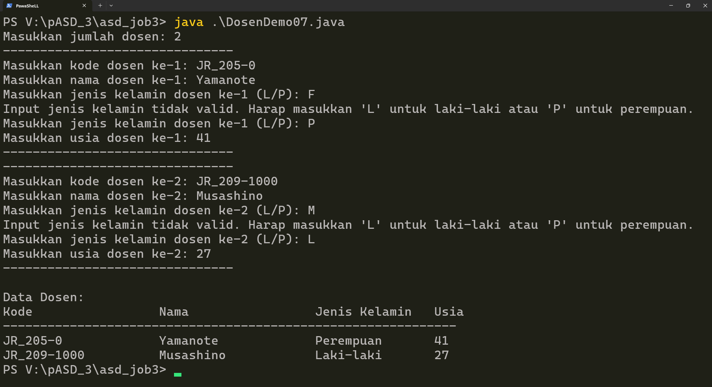
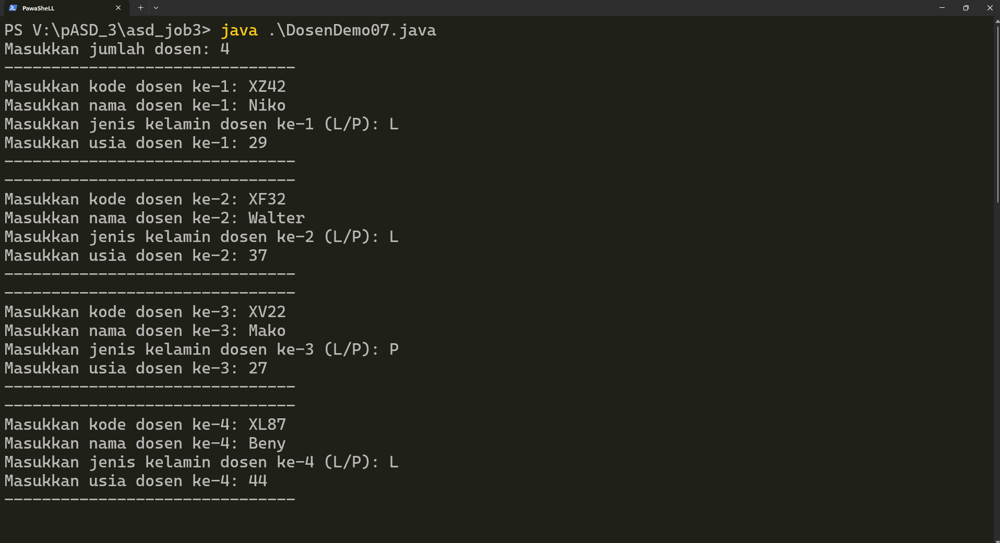
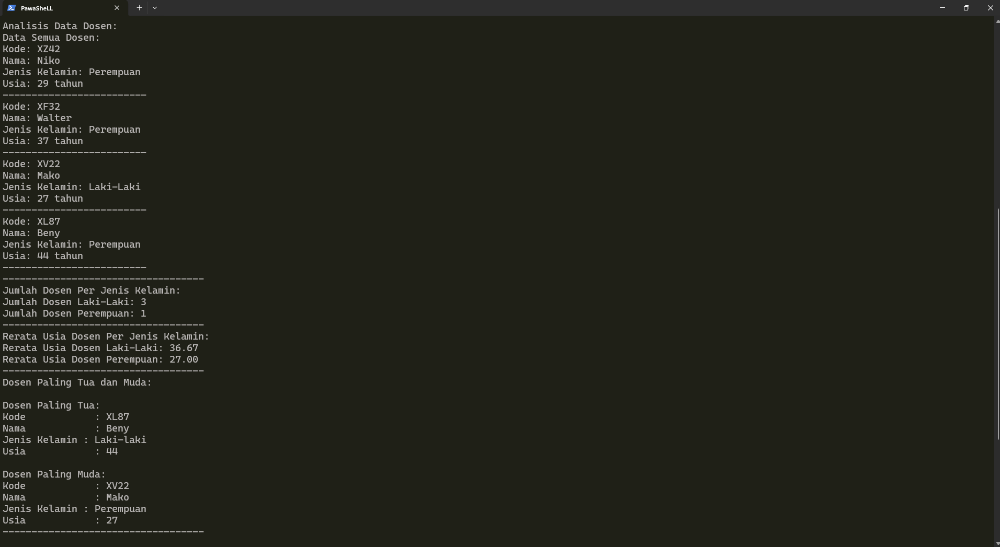
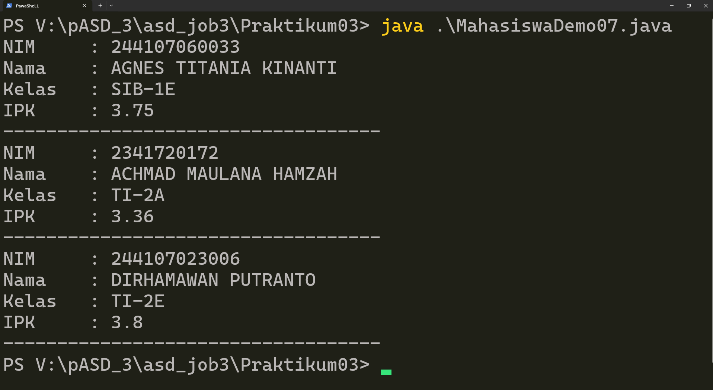
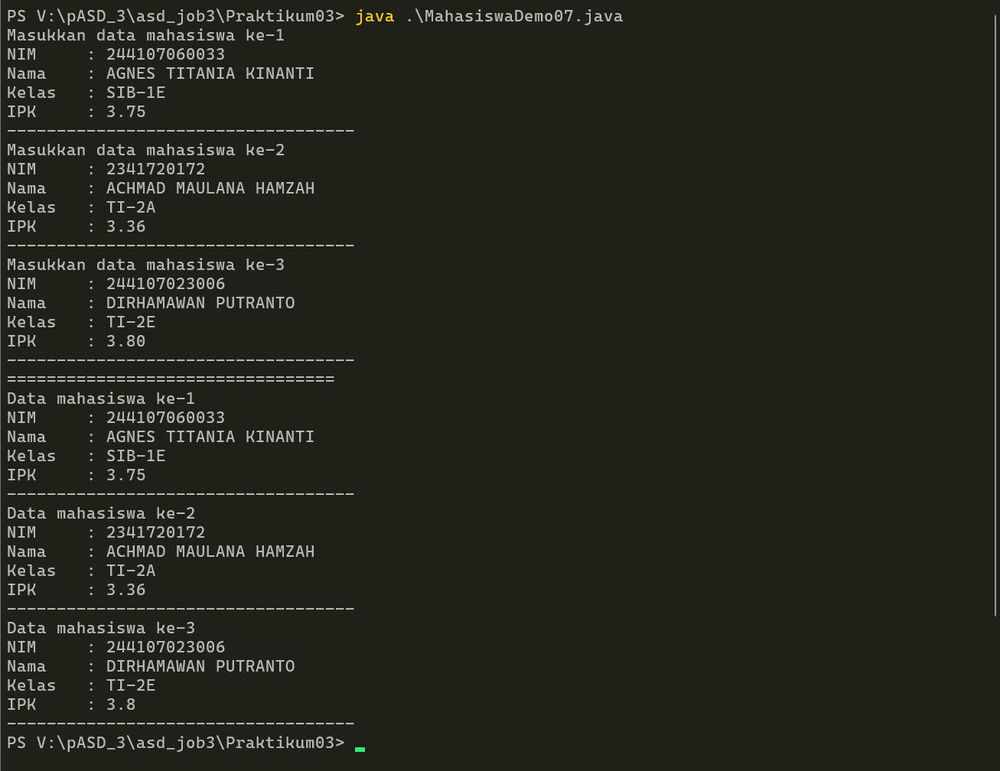
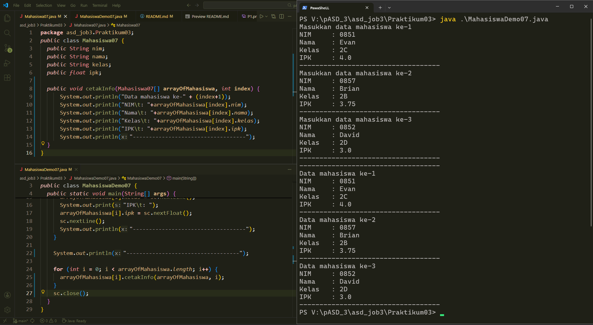
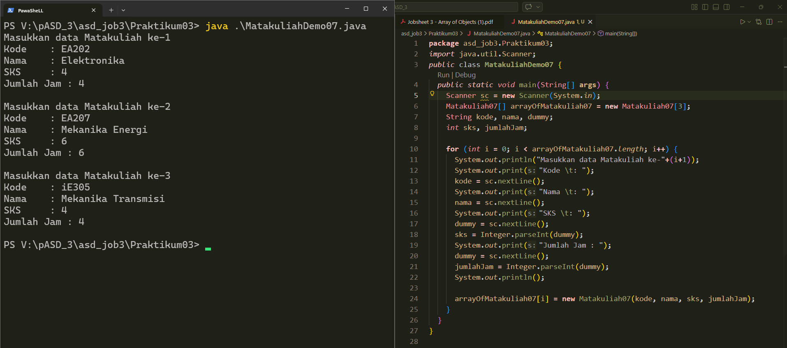
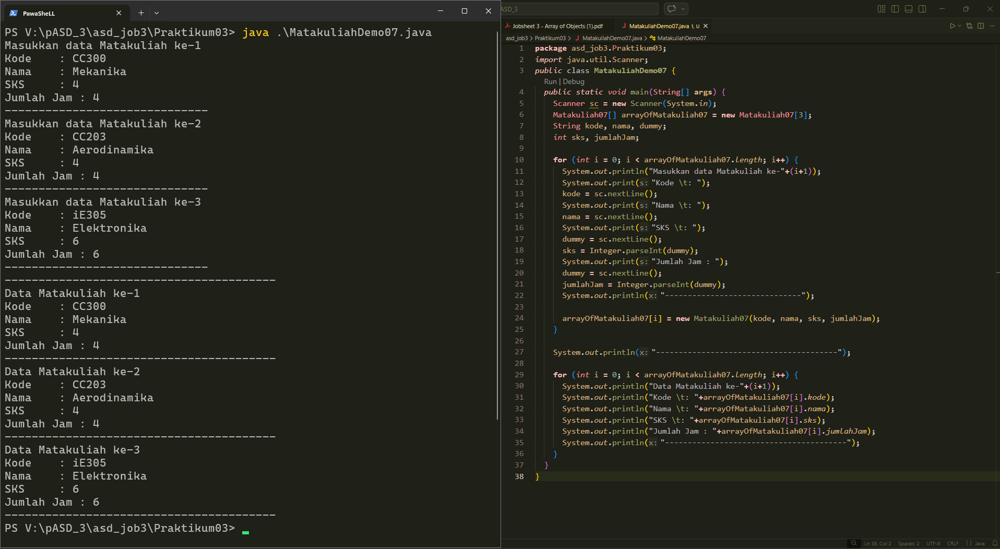
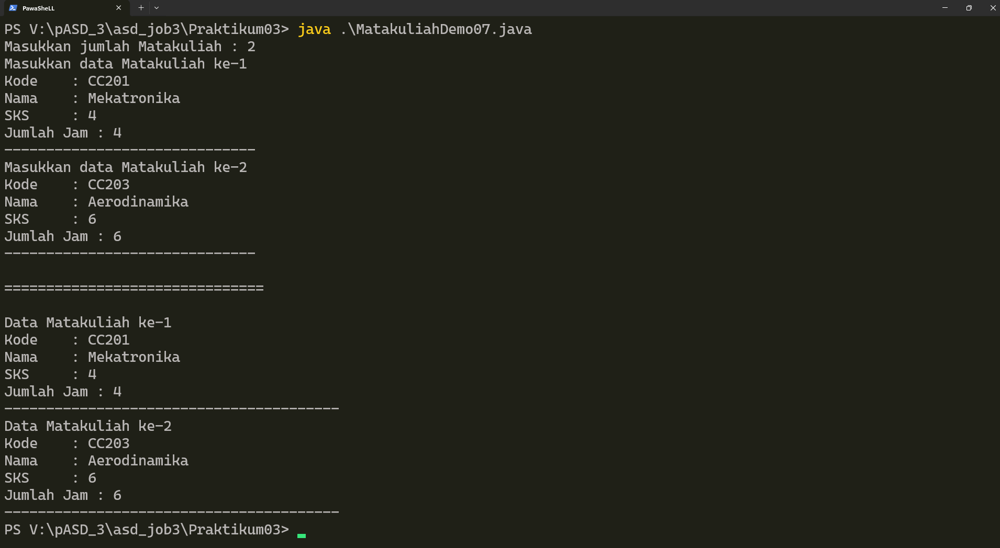

# [Tugas](#tugas-1)  
# [Daftar_Percobaan](#daftar_percobaan-1)  

# TUGAS
[**Tugas 1**](#tugas_1)  
[**Soal Tugas 1**](#soal_tugas_1)  
[**Jawaban Tugas 1**](#jawaban_tugas_1)  

[**Tugas 2**](#tugas_2)  
[**Soal Tugas 2**](#soal_tugas_2)  
[**Jawaban Tugas 2**](#jawaban_tugas_2)  


## TUGAS_1    
### SOAL_TUGAS_1
Soal :    
Buatlah program untuk menampilkan informasi tentang dosen. Program dapat menerima input semua informasi terkait dosen dan menampilkanya kembali ke layar. Program ini terdiri dari class ` Dosen<NoPresensi>` dengan attribute/property sebagai berikut;
```java
  String kode
  String nama
  Boolean jenisKelamin
  int usia
```
dengan methode constructor sebagai berikut;
```java
  public dosen(String kode, String nama, Boolean jenisKelamin, int usia) {
    ..........;
    ..........;
  }
```
Kemudian buatlah class `DosenDemo<NoPresensi>` untuk proses input dan menampilkan data beberapa dosen. Gunakan looping dengan **`FOR`** untuk pembuatan **`array of object`**. Gunakan looping dengan **`FOREACH`** untuk menampilkan data ke layar.

### JAWABAN_TUGAS_1  
[**Dosen07.java**](/asd_job3/Dosen07.java)  
[**DosenDemo07.java (commit 9b33aa9, terdapat update untuk commit selanjutnya di tugas 2)**](https://github.com/okeokke/asd_job3/commit/9b33aa95ea13145443166d516ef1922cd34059fd#diff-6e794f8951a6349167d0cedf2ff5b2000e6c8b71fd5e53a0f1730c53d7cc49a4)  
  
  Contoh Output :   
    


---  

## TUGAS_2  
### SOAL_TUGAS_2
Soal :  
Tambahkan class baru `DataDosen<NoPresensi>` dengan beberapa method berikut;
a. `dataSemuaDosen (Dosen[] arrayOfDosen)` untuk menampilkan data semua dosen
b. `jumlahDosenPerJenisKelamin(Dosen[] arrayOfDosen)` untuk menampilkan data jumlah dosen per jenis kelamin (Pria / Wanita)
c. `rerataUsiaDosenPerJenisKelamin(Dosen[] arrayOfDosen)` rata-rata usia dosen per jenis kelamin (Pria / Wanita)
d. `infoDosenPalingTua(Dosen[] arrayofDosen)` untuk menampilkan data dosen paling tua
e. `infoDosenPalingMuda(Dosen[] arrayofDosen)` untuk menampilkan data dosen paling muda

Semua method tersebut harus bisa dipanggil/ditest dari class DosenDemo


### JAWABAN_TUGAS_2  
[**DosenDemo07.java**](/asd_job3/DosenDemo07.java)  
[**DataDosen07.java**](/asd_job3/DataDosen07.java)  
log output program juga bisa diakses di :
[https://enjoys.rocks/?36cceb697e0f1bf4#Ey78e3SkFGw1XU4jLNRqkm51MEvgVPNrETiCca5S6JTG](https://enjoys.rocks/?36cceb697e0f1bf4#Ey78e3SkFGw1XU4jLNRqkm51MEvgVPNrETiCca5S6JTG)  
dengan password : `abil1f07`

Contoh input :  

Contoh Output :  

---  

# Daftar_Percobaan
1. [Percobaan 1](#percobaan-1)
- [Pertanyaan](#pertanyaan)
    * [Jawaban](#jawaban)
2. [Percobaan 2](#percobaan-2)
- [Pertanyaan](#pertanyaan-1)
    * [Jawaban](#jawaban-1)
3. [Percobaan 3](#percobaan-3)
- [Pertanyaan](#pertanyaan-2)
    * [Jawaban](#jawaban-2)

---

## Percobaan 1  
[Initial **Mahasiswa07.java** (commit cea5051)](https://github.com/okeokke/asd_job3/blob/cea50512fd86e8bedde2384bb6328355379badca/Praktikum03/Mahasiswa07.java)  
[Initial **MahasiswaDemo07.java** (commit cea5051)](https://github.com/okeokke/asd_job3/blob/cea50512fd86e8bedde2384bb6328355379badca/Praktikum03/MahasiswaDemo07.java)  
Screenshot Initial [MahasiswaDemo07.java (commit cea5051)](https://github.com/okeokke/asd_job3/blob/cea50512fd86e8bedde2384bb6328355379badca/Praktikum03/MahasiswaDemo07.java)  

[Kembali ke #Daftar_Percobaan](#daftar_percobaan-1)

### Pertanyaan
1. Berdasarkan uji coba 3.2, apakah class yang akan dibuat array of object harus selalu memiliki atribut dan sekaligus method? Jelaskan!  
2. Apa yang dilakukan oleh kode program berikut?
```java
Mahasiswa07[] arrayOfMahasiswa = new Mahasiswa07[3];
```  
3. Apakah class Mahasiswa memiliki konstruktor? Jika tidak, kenapa bisa dilakukan pemanggilan konstruktur pada baris program berikut?
```java
arrayOfMahasiswa[0] = new Mahasiswa07();
```  
4. Apa yang dilakukan oleh kode program berikut?`
```java
arrayofMahasiswa[0] = new Mahasiswa07();
arrayOfMahasiswa[0].nim = "244107060033";
arrayOfMahasiswa[0].nama = "AGNES TITANIA KINANTI";
arrayOfMahasiswa[0].kelas = "SIB-1E";
arrayOfMahasiswa[0].ipk = (float) 3.75;
```  
5. Mengapa class Mahasiswa dan MahasiswaDemo dipisahkan pada uji coba 3.2?  
  
[Kembali ke #Daftar_Percobaan](#daftar_percobaan-1)

### Jawaban
1. Tidak perlu, class/object kosong pun tetap bisa dibuat array-nya, tetap bisa di-instansiasi, dan tetap valid.  
Tetapi secara konsep/desain, objek adalah representasi entitas, dan lebih baik memiliki atribut, dan method yang opsional.  
2. Kode tersebut membuat sebuah array dengan length 3, dengan tipe data berupa objek yaitu Mahasiswa tetapi belum ada isinya.  
3. Jika dalam sebuah class tidak dibuat constructor apapun, java akan membuat default constructor tanpa parameter secara otomatis. Tetapi jika ada constructor sendiri dengan parameter dan tidak ada constructor kosongan, `new Mahasiswa07()` akan error.  
4. Kode membuat object baru `Mahasiswa07` yang disimpan ke indeks 0 array lalu setiap atribut pada objek `Mahasiswa07` di array indeks tersebut di-isi. Jika tidak ada `arrayOfMahasiswa [0] = new Mahasiswa07();`, akan error `NullPointerException`, karena array indeks 0 masih belum diisi objek.
5. Objek/Class `Mahasiswa07` berfungsi sebagai entitas/data dengan atribut dan atau method, sedangkan `MahasiswaDemo07` berfungsi sebagai penjalan program atau fungsi mainnya. Pemisahan dilakukan agar kode lebih rapi dan modular.


  
[Kembali ke #Daftar_Percobaan](#daftar_percobaan-1)

---

## Percobaan 2  
[**MahasiswaDemo07.java (commit 3392dcf)**](https://github.com/okeokke/asd_job3/blob/3392dcffd69811cecf515fa0c2e51d619ebce77e/Praktikum03/MahasiswaDemo07.java)


   
[Kembali ke #Daftar_Percobaan](#daftar_percobaan-1)

### Pertanyaan
1. Tambahkan method `cetakInfo()` pada class `Mahasiswa` kemudian modifikasi kode program pada langkah no 3.
2. Misalkan Anda punya **array baru** bertipe **`array of Mahasiswa`** dengan nama **`myArrayOfMahasiswa`**. Mengapa kode berikut menyebabkan error?
```java
Mahasiswa [] myArrayOfMahasiswa = new Mahasiswa [3];
myArrayOfMahasiswa[0].nim = "244107060033";
myArrayOfMahasiswa [0] .nama = "AGNES TITANIA KINANTI";
myArrayOfMahasiswa [0].kelas = "SIB-1E";
myArrayOfMahasiswa [0].ipk = (float) 3.75;
```  
  
[Kembali ke #Daftar_Percobaan](#daftar_percobaan-1)

### Jawaban
1. [**Mahasiswa07.java**](/asd_job3/Praktikum03/Mahasiswa07.java)  
[**MahasiswaDemo07.java**](/asd_job3/Praktikum03/MahasiswaDemo07.java)  

2. Program mencoba mengakses indeks-0 dari array `myArrayOfMahasiswa` ber-tipe-data objek `Mahasiswa07`, tetapi, indeks-0 tersebut masih kosong/null, belum di-instansiasi/di-isi oleh objek yang dibutuhkan (objek `Mahasiswa07`), menyebabkan error `NullPointerException`.  
  
  
[Kembali ke #Daftar_Percobaan](#daftar_percobaan-1)

---

## Percobaan 3  
[**Matakuliah07.java | Commit Awal (24b8847)**](https://github.com/okeokke/asd_job3/commit/24b88476149aa30c19e4668054eb7f9e83c8b906#diff-ac9ed9e1c5d02ed1926d7f57cf4ed57b54c0060c8a60ebe7fa25d98fc2aecdc9)  
[**MatakuliahDemo07.java | Commit Awal (24b8847)**](https://github.com/okeokke/asd_job3/commit/24b88476149aa30c19e4668054eb7f9e83c8b906#diff-1af6b510ebbf5f56687e2790e9be8e3d3c20f17f6c1ad75cb6f338fe00c42076)  
Percobaan 3 pada step 3 :  
  
Percobaan 3 pada step 4 :   
  
  
  
[Kembali ke #Daftar_Percobaan](#daftar_percobaan-1)

### Pertanyaan
1. Apakah suatu class dapat memiliki lebih dari 1 constructor? Jika iya, berikan contohnya
2. Tambahkan method `tambahData()` pada class `Matakuliah`, kemudian gunakan method tersebut di class `MatakuliahDemo` untuk menambahkan data Matakuliah
3. Tambahkan method `cetakInfo()` pada class `Matakuliah`, kemudian gunakan method tersebut di class `MatakuliahDemo` untuk menampilkan data hasil inputan di layar
4. Modifikasi kode program pada class `MatakuliahDemo` agar panjang (jumlah elemen) dari `array of object Matakuliah` ditentukan oleh user melalui input dengan Scanner
  
[Kembali ke #Daftar_Percobaan](#daftar_percobaan-1)

### Jawaban
1. Ya, contohnya ada pada jobsheet sebelumnya (jobsheet 2) pada file [Dosen07.java / Jobsheet 2](https://github.com/okeokke/asd-job2-smt2/blob/main/Dosen07.java), dengan satu konstruktor tanpa parameter, dan satu konstruktor berparameter.
```java
public class Dosen07 {
  String idDosen;
  String nama;
  boolean statusAktif;
  int tahunBergabung;
  String bidangKeahlian;

  public Dosen07() {
  }

  public Dosen07(String idDosen, String nama, boolean statusAktif, int tahunBergabung, String bidangKeahlian) {
    this.idDosen=idDosen;
    this.nama=nama;
    this.statusAktif=statusAktif;
    this.tahunBergabung=tahunBergabung;
    this.bidangKeahlian=bidangKeahlian;
  }
  ...
  ...
  ...
```
2. (2, 3, & 4)  
Contoh output :  
  
  
[**Matakuliah07.java**](Praktikum03/Matakuliah07.java) :   
```java
.....
.....

  public static Matakuliah07 tambahData(Scanner sc) {
    String kode, nama;
    int sks, jumlahJam;
    String dummy;
    System.out.print("Kode \t: ");
    kode = sc.nextLine();
    System.out.print("Nama \t: ");
    nama = sc.nextLine();
    System.out.print("SKS \t: ");
    dummy = sc.nextLine();
    sks = Integer.parseInt(dummy);
    System.out.print("Jumlah Jam : ");
    dummy = sc.nextLine();
    jumlahJam = Integer.parseInt(dummy);

    return new Matakuliah07(kode, nama, sks, jumlahJam);
  }

  public void cetakInfo() {
    System.out.println("Kode \t: "+this.kode);
    System.out.println("Nama \t: "+this.nama);
    System.out.println("SKS \t: "+this.sks);
    System.out.println("Jumlah Jam : "+this.jumlahJam);
  }
  ...
  ...

```
[**MatakuliahDemo07.java**](Praktikum03/MatakuliahDemo07.java) :   
```java

...
...

    System.out.print("Masukkan jumlah Matakuliah : ");
    int jmlMK = Integer.parseInt(sc.nextLine());

    Matakuliah07[] arrayOfMatakuliah07 = new Matakuliah07[jmlMK];

    for (int i = 0; i < arrayOfMatakuliah07.length; i++) {
      System.out.println("Masukkan data Matakuliah ke-"+(i+1));
      arrayOfMatakuliah07[i] = Matakuliah07.tambahData(sc);
      System.out.println("------------------------------");
    }

    System.out.println("\n===============================\n");
    
    for (int i = 0; i < arrayOfMatakuliah07.length; i++) {
      System.out.println("Data Matakuliah ke-"+(i+1));
      arrayOfMatakuliah07[i].cetakInfo();
      System.out.println("----------------------------------------");
    }

    ...
    ...

```


[Kembali ke #Daftar_Percobaan](#daftar_percobaan-1)
